# Credit_Risk_Analysis
Analyzing the risk of loans with several machine learning models

## Overview of the analysis
Explain the purpose of this analysis.

## Results (Balanced Accuracy Scores, Confusion Matrices, and Imbalanced Classification Reports) 

### Random Oversampling Model

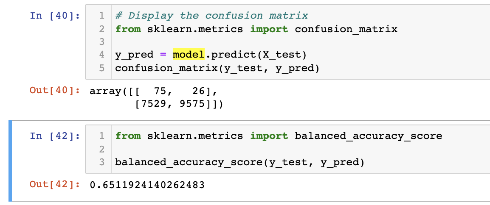
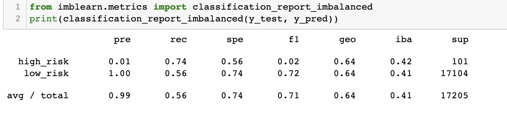
The balanced accuracy score was 65%. 
The high_risk precision is about 1% only with 74% sensitivity which makes a F1 of 2% only.
Due to the high number of the low_risk population, its precision is almost 100% with a sensitivity of 56%.

### SMOTE Oversampling Model

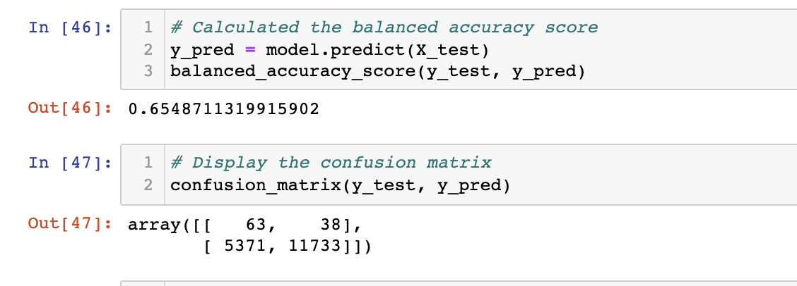
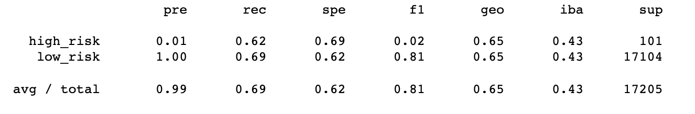
These results are similar to the first oversampling model above. 
The balanced accuracy score was 66%. 
The high_risk precision is about 1% only with 62% sensitivity which makes a F1 of 2%.
Due to the high number of the low_risk population, its precision is almost 100% with a sensitivity of 69%.

### ClusterCentroid Undersampling Model

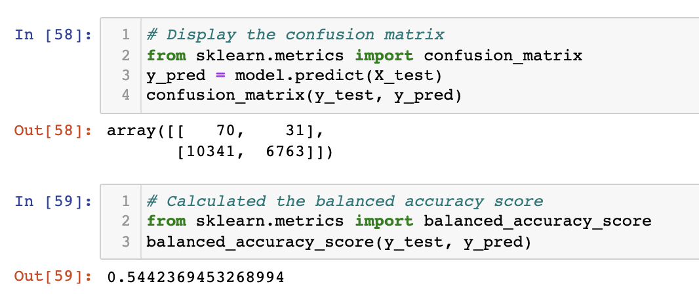
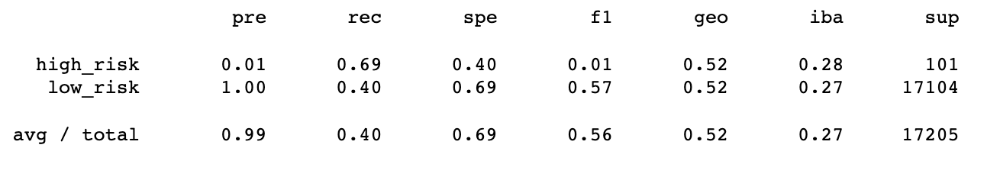
The balanced accuracy score reduced to 54%. 
The high_risk precision is still 1% with 69% sensitivity. This makes a F1 of only 1%.
Due to the high number of false positive results, the sensitivity for low_risk is 40%, though the precision is high.

### SMOTEEN Combination Sampling Model

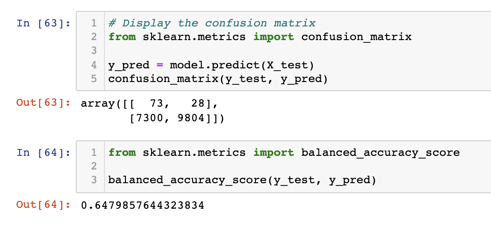
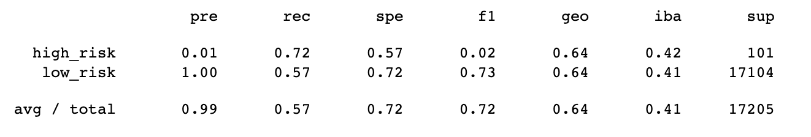
The balanced accuracy score was 65%, similar to the oversampling models. 
The high_risk precision is 1% with 72% sensitivity which makes a F1 of 2%, simialar to the oversampling models.
The number of the false posisitve in the low_risk population is lower so the sensitivity increased to 57% from the undersampling model.

### Blanced Random Forest Classifier Model

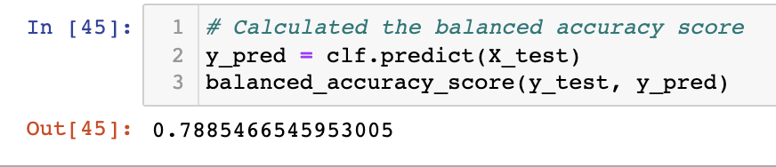
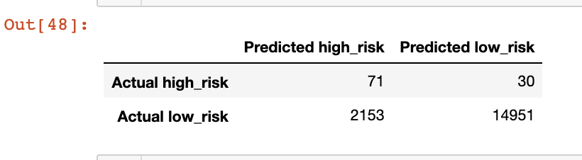
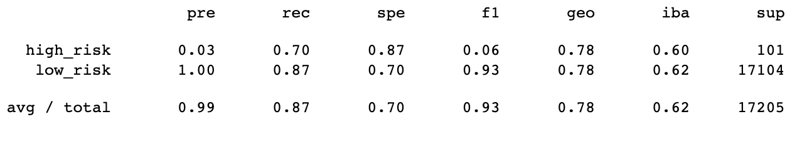
The balanced accuracy score was now higher at 79%. 
The high_risk precision remains low at 3% with a 70% sensitivity. This makes a slightly higher F1 of 6%.
Due to a smaller number of false positives, the low_risk precision is 100% with a sensitivity of 87%. This is an improvement over the previous models. 

### Easy Ensemble Calssifier Model 

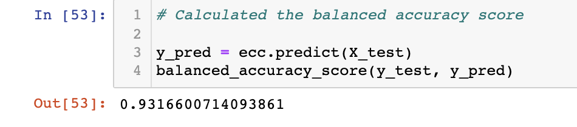
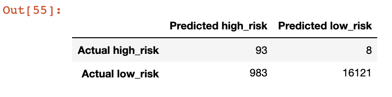
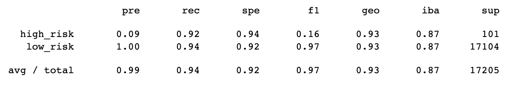
The balanced accuracy score is very high at 93%. 
The high_risk precision remains low at 9% with a 92% sensitivity. This results in the highest F1 of 16%.
There are fewer false positives, the low_risk precision is 100% with a sensitivity of 94%. This is a huge improvement over the previous models. 

## Summary
Summarize the results of the machine learning models, and include a recommendation on the model to use, if any. If you do not recommend any of the models, justify your reasoning.
